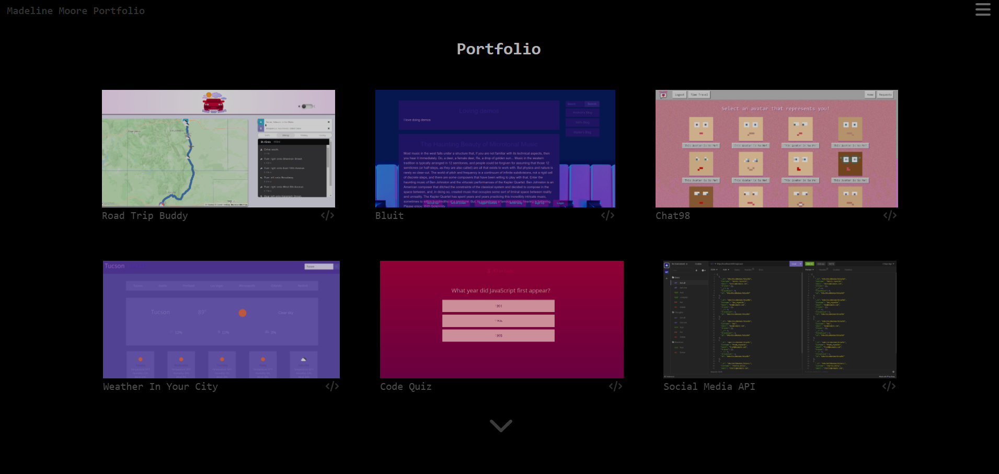

# React-Portfolio

## Description

This portfolio uses React to display my current developer portfolio as of August 2023 to potential employers, and was built for Denver University's Coding Boot Camp as part of a challenge assignment.

## Table of Contents

- [Installation](#installation)
- [Usage](#usage)
- [Credits](#credits)
- [Tests](#tests)
- [Questions](#questions)
- [Contributing](#contributing)
- [License](#license)

## Installation

N/A

## Usage

Navigate to https://msjamesm.github.io/react-portfolio/. Use the menu in the top right corner of the page or the arrow at the bottom of the page to navigate through the application.

## Credits

[Geoff Graham](https://css-tricks.com/snippets/css/typewriter-effect/)

https://www.w3schools.com

https://react.dev

## Tests

There is currently no testing available for this project.

## Questions

For questions or comments regarding this application, repository, or other projects of mine, please contact me at https://github.com/MsJamesM or MissJamesM@yahoo.com.

## Contributing

Contributions to this project are currently not permitted. Please contact me at https://github.com/MsJamesM or MissJamesM@yahoo.com for additional questions or feedback about contributing.

## License

This project is licensed under the [MIT License](https://en.wikipedia.org/wiki/MIT_License)
